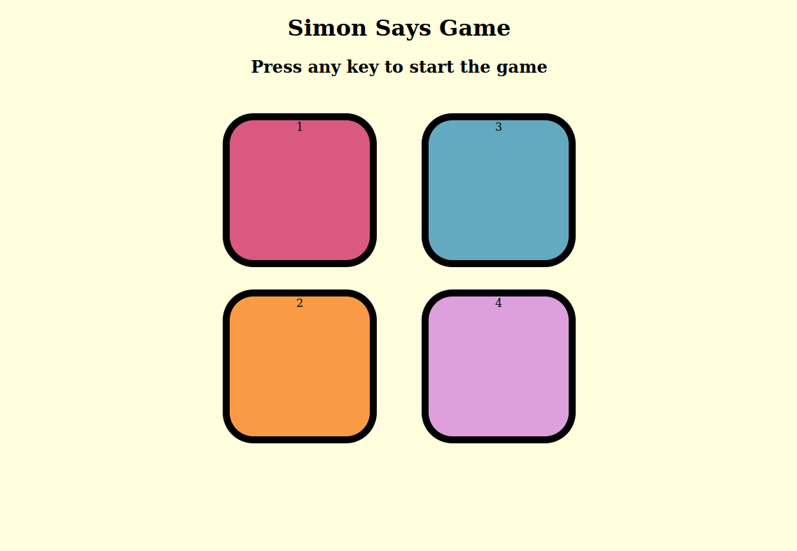

#Simon Says Game

Simon Says is a memory game in which the player must repeat a sequence of colors and sounds randomly throughout the game. The game consists of four colored buttons (red, green, yellow and blue) that light up and sound in a longer and longer sequence.

#How to play?

In order to play the game, the player must wait for a sequence of colors and sounds to be generated. The player must then repeat the sequence by pressing the corresponding buttons in the same order that they were lit. If the player makes a mistake, the game is over.

